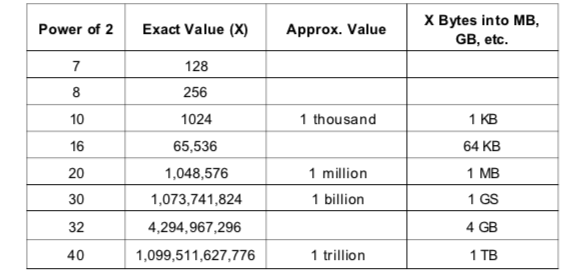

# Technical Questions

## A list of absolutely must know knowledge:

Need to know each implementation and its runtime and space.

| Data Structures       |      Algorithms      |              Concepts |
| --------------------- | :------------------: | --------------------: |
| Linked Lists          | Breadth-First Search |      Bit manipulation |
| Trees, Tries & Graphs |  Depth-First Search  | Memory(Stack vs Heap) |
| Stacks & queques      |    Binary Search     |             Recursion |
| Heaps                 |      Merge Sort      |   Dynamic Programming |
| ArrayLists/Vectors    |      Quick Sort      |  Big O time and Space |
| Hash Tables           |                      |                       |

## Power of 2 table

## Work Through a problem

+ Listen: write down necessary information.
+ Example: Write a big enough non-special-case example.
+ Brute force: State a naive algorithm and its runtime, don't code yet.
+ Optimize: Walk through brute force with BUD optimization:

    + Buttolenecks
    + Unnessary work
    + Duplicated Work
    + Time vs space tradeoff: consider a Hash table
    + Unused info
    + Solve it manully on a example

+ Walk Through: Walk through your approach in detail. Make sure you understand each detail before you start coding.
+ Implement: Modularize your code from the beginning and refactor to clean up anything that isn't beautiful.
+ Test: 

    + Conceptual test: Walk through your code again.
    + Look for unusual or non-standard code.
    + Hot spots, like arithmetic and null nodes.
    + Small test cases.
    + Special and edge cases.

## 1. Arrays and Strings

[Arrays and Strings](1.ArraysandStrings.md)

## 2. Linked Lists

[Linked Lists Questions](2.LinkedList.md)

## 3. Stacks and Queues

[Stacks and Queues Questions](3.StacksQueues.md)