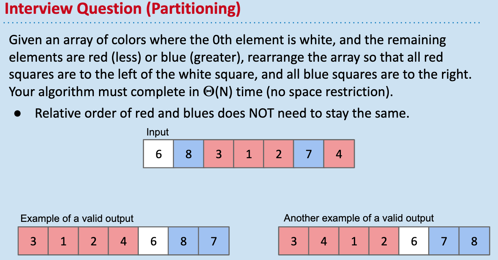
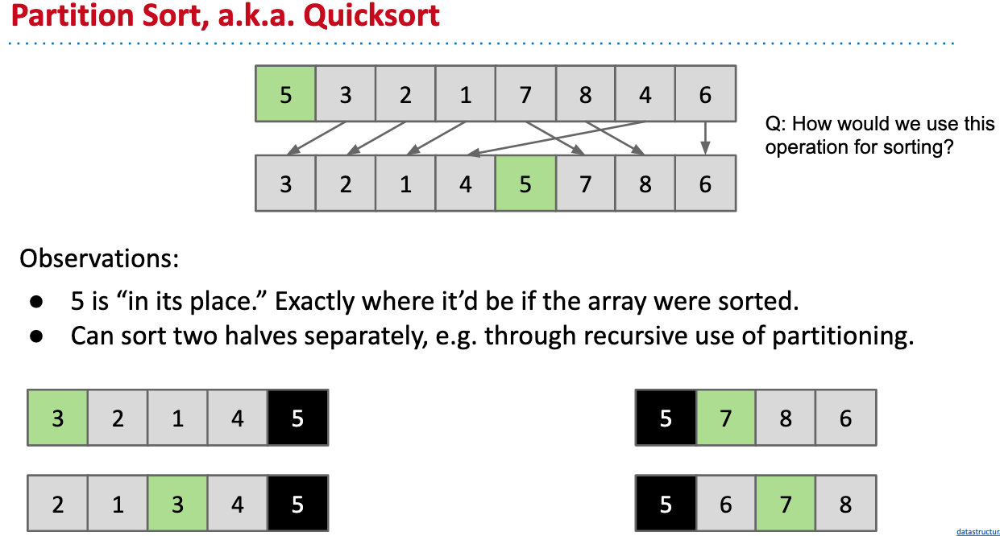

# Quick(Partition) Sort

Core idea of Quick Sort: Partitioning.

## Partitioning

To partition an array a[] on element x=a[i] is to rearrange a[] so that:

+ x moves to position j(may be the same as i)
+ All entries to the left of x are <= x
+ All entries to the right of x are >= x
+ Order of elements on the same side doesn't matter
  

Example:

```
Partion around the pivot index i = 2
[5, 550, 10, 4, 10, 9, 330]

We can have:
where pivot moved to j = 3 or 4
[4, 5, 9, 10, 10, 330, 5550]
or
[5,4,9,10,10,550,330]
```

Interview Question on Partitioning:



1. We can start from the end of array, if it is red, stick it to the leftmost position, skip blue ones.
2. Insert into BST, all the small items are on the left, all the large items are on the right.
3. 3-scan: create another array, scan and copy all red items to the first R places, then copy the white item, then scan the copy the blue items.


## Partition Sort.

Key idea: After partition, the pivot will be at its rightful place.



[demo](https://docs.google.com/presentation/d/1QjAs-zx1i0_XWlLqsKtexb-iueao9jNLkN-gW9QxAD0/edit)

## Its runtime

+ Best case : Theta(NlogN)
+ Worst case: Theta(N^2)
+ Randomly chosen array case: Theta(NlogN) expected

## Ways to implement

Tony Hoare: two pointer partition algorithm:

Two pointers walk towards each other: [demo](https://docs.google.com/presentation/d/1DOnWS59PJOa-LaBfttPRseIpwLGefZkn450TMSSUiQY/pub?start=false&loop=false&delayms=3000&slide=id.g463de7561_042)

+ Left pointer loves small items
+ Right pointer loves large items
+ Big idea: Walk towards each other, swapping anything they don't like.
+ End result is that things on left are small and things on the right are large.


## Quick Select

Use partitioning to find median.

## java.Arrays.sort


Why?

Because quicksort is not stable, but when performing on primitive values, you won't notice a difference as primitive valus have no identity.

## Implementation on integers

```java
public void quicksort(int[] a) {
    quicksort(a, 0, a.length - 1);
}

private void quicksort(int[] a, int lo, int hi) {
    if (hi <= lo) return;
    int j = partition(a, lo, hi);
    quicksort(a, lo, j - 1);
    quicksort(a, j + 1, hi);
}

// partition the subarray a[lo,.,.,.,hi] so that 
// a[lo,.,j-1] <= a[j] <= a[j+1,.,.,.hi]
// and return index j.
private int partition(int[] a, int lo, int hi) {
    int i = lo;
    int j = hi + 1;
    int pivot = a[lo]

    while (true) {
        // find item on lo to swap
        while (a[i] < pivot) {
            if (i == hi) break;
            i++
        }
        // find item on hi to swap
        while (a[j] > pivot) {
            if (j == lo) break;
            j--;
        }
        // check if pointers cross
        if (i >= j) break;

        swap(a, i, j);
    }
    // put pivot item v at a[j]
    swap(a, lo, j)
    // now, a[lo,.,j-1] <= a[j] <= a[j+1,.,.,.hi]
    return j;
}

// helper: swap a[i] and a[j]
private void swap(int[] a, int i, int j) {
    int temp = a[i];
    a[i] = a[j];
    a[j] = temp;
}
```