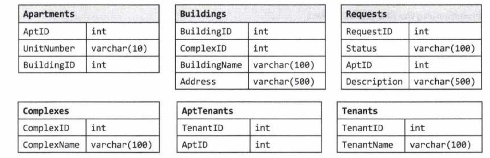

1. Multiple apartments : Write a SQL query to get a list of tenants who are renting more than one apartment.

```sql
SELECT TenantName FROM
Tenants inner join 
    (SELECT TenantID from AptTenants GROUP BY TenantID HAVING count(*) > 1) AS C 
    ON Tenants.TenantID = C.TenantID
```

2. Open Requests: Write a SQL query to get a list of all buildings and the number of open requests (Requests in which status equals 'Open')

Join requests and Apartments on AptID

```sql
SELECT BuildingName, ISNULL(Count, 0) as 'Count'
FROM Buildings
LEFT JOIN
    (SELECT Apartments.BuildingID, count(*) as 'Count'
     FROM Requests INNER JOIN Apartments
     ON Requests.AptID = Apartments.AptID
     WHERE Requests.status = 'Open'
     GROUP BY Apartments.BuildingID) as ReqCounts
ON ReqCounts.BuildingID = Buildings.BuildingID
```

3. Close All Requests: Building #11 is undergoing a major renovation. Implement a query to close all requests from apartments in this building.

Get all apartments with BuildingID 11.

```sql
UPDATE Requests
SET status = 'Closed'
WHERE AptID IN (SELECT AptID FROM Apartments WHERE BuildingID = 11)
```