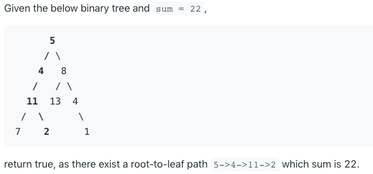

# Paths with Sum:

leetcode 112

Given a binary tree and a sum target, determine if the tree has a root-to-leaf path such that adding up all the values along the path equals the given sum.

Example:



My attemps and thoughts:

what about just find all the paths, and see if one of them is true.

## Solution 1: Recursion

```java
class Solution {
    public boolean hasPathSum(TreeNode root, int sum) {
        if (root == null) return 0;

        sum = sum - root.val;

        if ((root.left == null) && (root.right == null)) {
            return sum == 0;
        }

        return hasPathSum(root.left, sum) || hasPathSum(root.right, sum);
    }
```

## Solution 2: Iteration

DFS with the help with **Stack**

idea:

Start with a **Stack** which contains the root node and the corresponding remaining sum which is `sum-root.val`.

Then we proceed to the iterations: pop the current node out of the stack and return true if the remaining sum is 0 and we are on a leaf.

If the remaining sum is not zero or we're not on the leaf yet then we push the child nodes and corresponding remaining sums into stack.

```java
public boolean hasPathSum(TreeNode root, int sum) {
    LinkedList<TreeNode> nodeStack = new LinkedList<>();
    LinkedList<Integer> sumStack = new LinkedList<>();

    nodeStack.add(root);
    sumStack.add(sum - root.val);

    TreeNode node;
    int currSum;
    while (!nodeStack.isEmpty()) {
        // .pollLast(), retrieves and removes the head of the list.
        node = nodeStack.pollLast();
        currSum = sumStack.pollLast();

        if ((node.left == null) && (node.right == null) && (currSum == 0)) return true;

        if (node.left != null)
            nodeStack.push(node.left);
            sumStack.push(currSum - node.left.val);
        if (node.right != null)
            nodeStack.push(node.right);
            sumStack.push(currSum - node.right.val);

    }
    return false;
}
```
