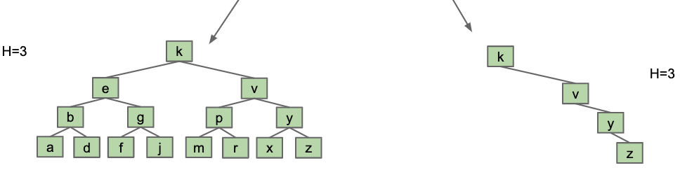
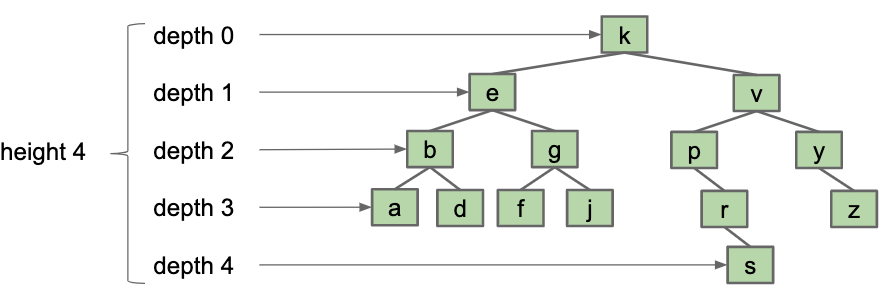
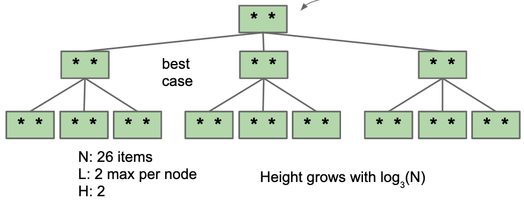

# B-Trees

## BST Tree Height

Trees height range from best case "bushy" to worst-case "spindly".

Example:



Let H(n) be the height of a tree with N nodes. Give H(N) in Big-Theta notation for "bushy" and "spindly" trees, 

H = Theta(logN) for bushy tree

H = Theta(N) for spindly tree

### Note: Big-O is not worst case

Example: Which of the these statements are true?

A. Worst case BST height is Theta(N).

B. BST height is O(N).

C. BST height is O(N^2).

All of above are true.

All BSTs have a height that grows linearly or better than O(N), so even better than O(N^2).

But only A have useful information.


In conclusion, BST height is : Theta(logN) in best case, Theta(N) in worst case.

## Height and Depth of a Tree

Height and average depth are important properties of BSTs.

+ The depth of a node is how far it is from the root. root has depth 0. e.g. depth(g) = 2
+ The height of a tree is the depth of its deepest leaf, e.g. height(T) = 4
+ The average depth of a tree is the average depth of all its nodes:
    
    + (0x1 + 1x2 + 2x4 + 3x6 + 4x1)/ (1+2+4+6+1) = 2.35
    


## BST in practice.

The order of how we add elements result in different trees.

We want BSTs to be as bushy as possible.

### Randomized BSTs

It does give us expected average depth 4.7log(N) so, Theta(logN).

So we can have Theta(logN) insertion if we insert randomly,

But we can't always insert our items in a random order, why?

: Data comes in over time, we don't have all the data at once.


## B-trees/2-3 trees/ 2-3-4 trees

So how to keep a log(N) height?

### 1. Crazy idea 1: we just over-stuff the leaf nodes.

    
            13                                      13
         5      15      add(17), add(18)       5          15
       2   7  14  16                        2    7     14   (16,17,18)

    
### 2. What's the problem with this???

One node will get too long and degenerate into a linked list.

### 3. Solution:

+ Set a Limit L on the number of items, say L = 3;
+ If any Node has more than L items, give an item to its parent;

    + Pulling item out of full node splits it into left and right.
    + Parent node now has three children.

```
        13
    5        15
2      7   14   (16, 17, 18, 19)

==>
          13
      5         (15, 17)
  2      7    14    16   (18,19)

```
  
This is a logically consistent data structure.

+ contians(18):

  + 18 > 13, go right
  + 18 > 15, compare with 17
  + 18 > 17, so go right

### Exercise

```
        13
    5        (15,17)
  2   7    14   16    (18,19,20,21)

  ==> at most L =3 items per node
  ==> move up the middle or left middle value.

        13
    5        (15, 17, 19)
  2   7     14  16  18  (20,21)


   add(25), add(26)

        13
    5        (15, 17, 19)
  2   7     14  16  18  (20,21,25,26)

  ==>
        13
    5         (15, 17, 19, 21)
  2   7     14   16  18  20  (25, 26) 

  ==> 

        (13, 17)
    5      15     (19, 21)
  2   7  14  16  18  20  (25,26) 

```

What if the root is too full?


```

      (13,  17,   21)
  5     15     19    (22,23,24,25)

  ==>
      (13,  17,  21,  23)
    5     15   19   22   (24, 25)

  ==>
          17
      13      (21, 23)
   5    15   19  22   (24, 25)
```

## B Trees: Splitting trees

Splitting tree is a better name, but their real name is: B-trees

+ B-trees of order L = 3 (what we used above) are also called a 2-3-4 tree: a node can have 2, 3, 4 children
+ B-trees of order L = 2 are also called a 2-3 tree.

## Exercise 1:

Add numbers 1,2,3,4,5,6,7 (in that order) into a regular BST

```
1
 2
  3
   4
    5
     6
      7
```

Add that into a 2-3 tree (L = 2). when L = 2, we push the middle item up.

```
1. add(1), add(2), add(3)
      (1, 2, 3)
  ==> push middle item up
          2
        1   3
2. add(4), add(5)
          2
        1   (3,4,5)
  ==> push 4 up
        (2, 4)
      1    3    5

3. add(6), add(7)
        (2, 4)
      1   3   (5,6,7)

  ==> push 6 up
        (2, 4, 6)
      1   3   5  7

  ==> push 4 up
            4
        2       6
    1     3   5   7
```

## Exercies 2:

Find an order to add 1,2,...,7, such that the resulting 2-3 tree has height 1.

```
          (3, 5)
      (1,2)  4  (6,7)
```

```
add(2),add(3),add(4)
                3
(2,3,4) ==>   2   4

add(1),add(5),add(6)

      3           ==>         (3, 5)
(1,2)   (4,5,6)           (1,2)  4   6

add(7)

      (3, 5)
  (1,2)  4  (6,7)
```

## B-Tree Invariants

Because of the way B-Trees are constructed, we get two nice invariants:

+ All leaves must be the same distance from the source.
+ A non-leaf node with K items must have exactly K+1 children.


## B-Tree Runtime analysis:

L: Max number of items per node

Height: Between logL+1(N) and log2(N)

+ Largest(worst) possible height is all non-leaf nodes have 1 item:

```
          a
        a   a
  (a,a)  a a  a

  N: 8 itmes
  L: 2 items max per node
  H: 2

  Height grows with log2(N)
```

+ Best possible height is all nodes have L items:




### Runtime for contains(x)

+ Worst case number of nodes to inspect: H + 1
+ Worst case number of items to inspect per node: L
+ Overall runtime: O(HL)

Since H = Theta(logN), overall runtime is O(LlogN), since L is constant, runtime is O(logN)

### Runtime for add(x)

+ Worst case number of nodes to inspect: H + 1
+ Worst case number of items to inspect per node: L
+ Worst case number of split operations: H + 1
+ Overall runtime: O(HL) = O(L)

Since H = Theta(logN), overall runtime is O(LlogN), since L is constant, runtime is therefor O(logN).


## Binary Search Tree Deletion

