# Balanced Search Trees

2-3 Trees are very hard to implement.

## BST Structure and Tree Rotation

## BSTs

Suppose we have a BST with the numbers 1, 2, 3. Five possible BSTs.

The specific BST you get is based on the insertion order.

Given any BST, it is possible to move to a different configuration using "rotation".

Our goal: Build a BST that is structurally identical to a 2-3 tree.

Since a 2-3 tree are balanced, so will our special BSTs.

## Left-Leaning Red Black Binary Search Tree

A BST with left glue links that represents a 2-3 tree is often called a “Left Leaning Red Black Binary Search Tree” or LLRB.
LLRBs are normal BSTs! 

There is a 1-1 correspondence between an LLRB and an equivalent 2-3 tree.

The red is just a convenient fiction. Red links don’t “do” anything special.

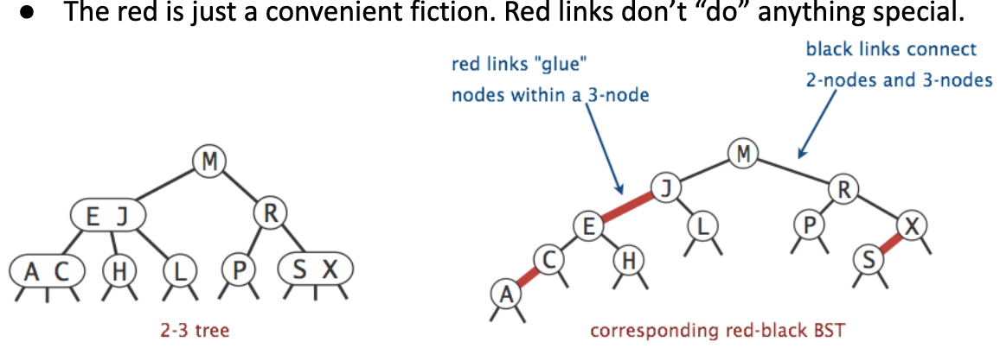


## Exercise 1:

```
       (u, w)
 (a, s)  v   (x, y)
```

The corresponding LLRB tree:

```
         w
     u      (x, y)
(a,s)  v

==>
        w
    u        y
  s   v    x
a
```

## Representing a 2-3 tree as a LLBST

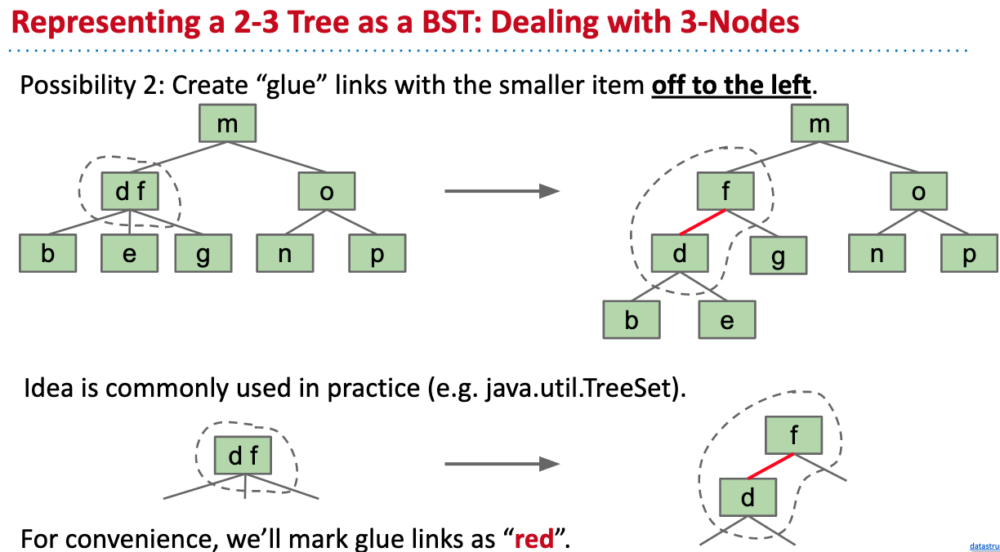

## Exercise 2:

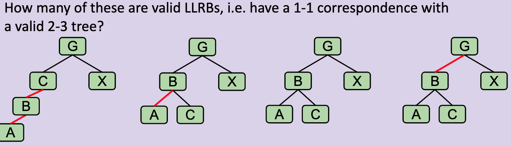

```
1)

        g
(a,b,c)  x    --> not a LLRB
2)
        g
 (a,b)     x  --> not a LLRB, its 2-3 tree is not balanced.
      c 

Note: 2-3 tree all leaves have the same depth to root.
3)
Note balanced
4) 
     (b, g)
a      c      x   --> valid LLRB
```

## Exercise 3:

How tall is the corresponding LLRB for the 2-3 tree below ?

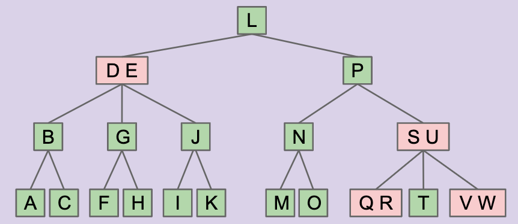

```
            l
                    p
                        u
                      s   (v, w)
                    r   t
                q
```

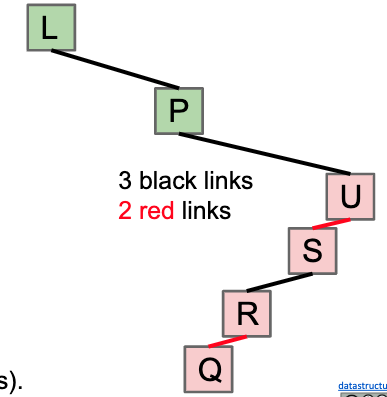

3(black) + 2(red) = 5 = total height

Generally, an LLRB has no more than 2x the height of its 2-3 tree


## Properties of LLRB

+ No node has two red links. (this one is obvious, since in its 2-3 tree, each node has at most 2 items)
+ Every path from root to a leaf has same number of black links (because 2-3 tree has same number of links to every leaf)

## Construction of LLRB

There exists a 1-1 mapping between : 2-3 tree and LLRB.

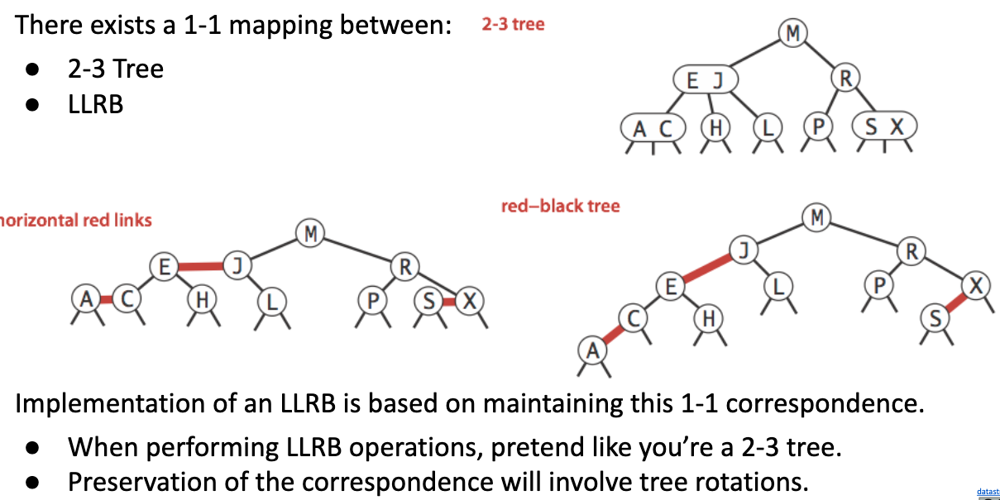

### Design Task 1: Insertion Color

Should we use a read or black link when inserting?

+ use red! In 2-3 tree new values are always added to a leaf node(at first)

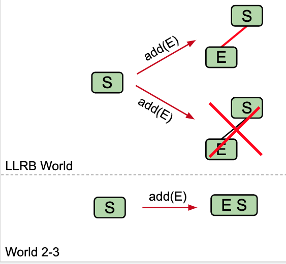

### Design Task 2: Insertion on the right

Suppose we have leaf E, and insert S with a red link. What do we do?????

Right red links are not allowed, so rotateLeft(E).

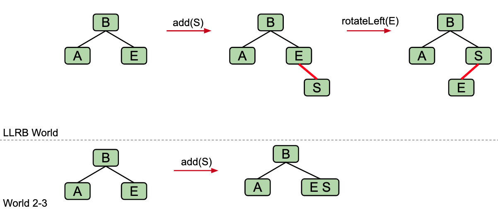


#### What is rotate left?


#### Representation of Temporary 4-nodes

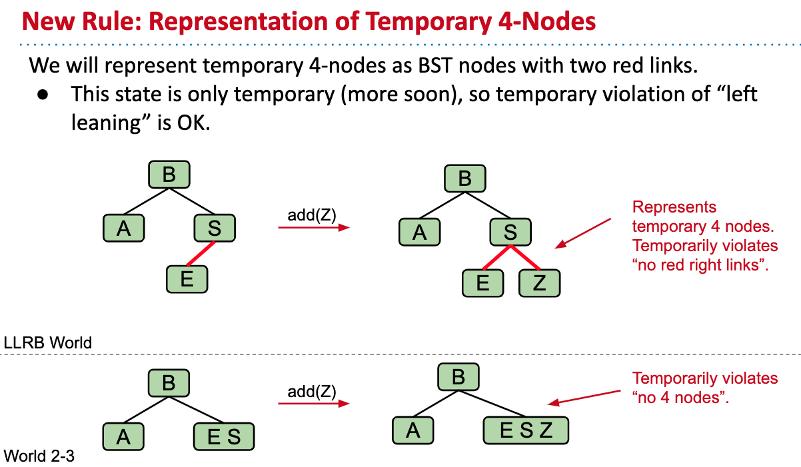

### Design Task 3: Double Insertion on the left

Suppose we have the LLRB below and insert E. We end up with the wrong representation for our temporary 4 node. What should we do so that the temporary 4 node has 2 red children(one left, one right) as expected.


So, what do we do????

We need to rotate Z right.

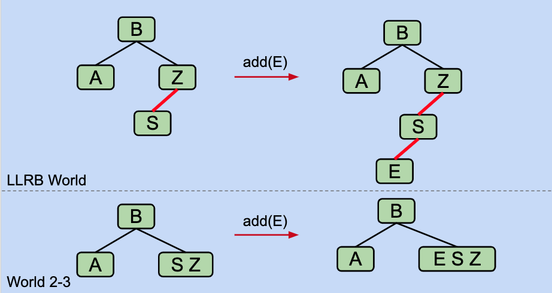


### Design Task 4: Splitting Temporary 4-nodes

Suppose we have the LLRB below which includes a temporary 4 node, what should we do next?

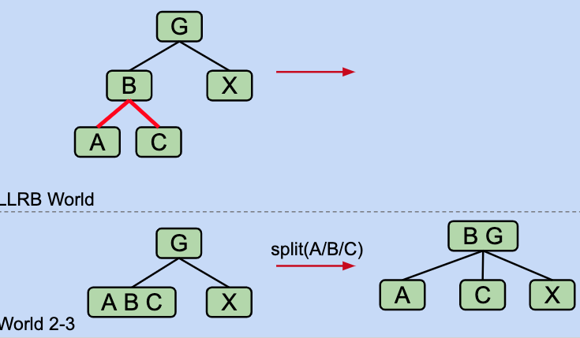

***Flip the colors of all edges touching B***

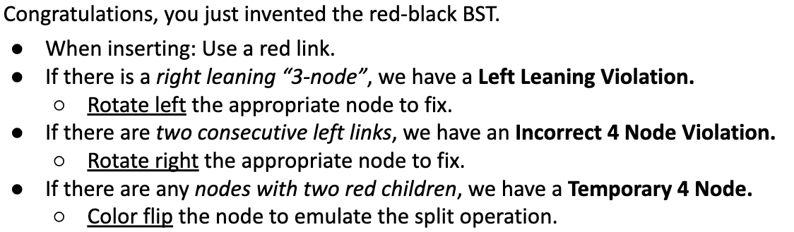