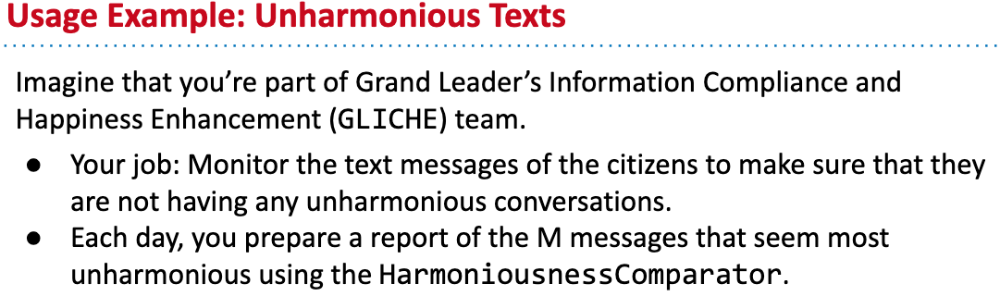
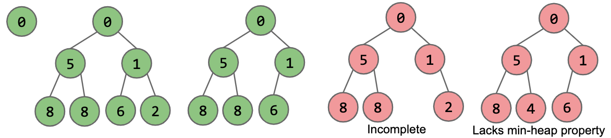
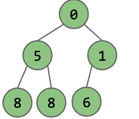

# The priority queue interface

```java
/** Min pq, allow tracking and removal of the smallest item in a priority queue. */
public interface MinPQ<Item> {
    /** Adds the item to the pq. */
    public void add(Item x);
    /** Returns the smallest item in the priority queue. */
    public Item getSmallest();
    /** Removes the smallest item from the priority queue. */
    public Item removeSmallest();
    /** Returns the size of the priority queue. */
    public int size();
}
```

## Use priority queue



Let's use Min priority queue.

```
MinPQ<String> unharmoniousTexts = new HeapMinPQ<Transaction>(cmptr);
```

## Solution: Track the most unharmonious texts

```java
public List<String> unharmoniousTexts(Sniffer sniffer, int M) {
    // Comparator
    Comparator<String> cmptr = new HarmoniousnessComparator();
    // MinPQ to track unharmonious texts
    MinPQ<String> unharmoniousTexts = new HeapMinPQ<Transaction>(cmptr);
    
    for (Time timer = new Timer(); timer.hours() < 24) {
        unharmoniousTexts.add(sniffer.getNextMessage());
        // The magic happens here, we only keep M texts
        if (unharmoniousTexts.size() > M) {
            unharmoniousTexts.removeSmallest();
        }
    }

    ArrayList<String> textlist = new ArrayList<String>();
    while (unharmoniousTexts.size() > 0) {
        textlist.add(unharmoniousTexts.removeSmallest());
    }
    return textlist;
}
```

# Min-Heap

## Min-Heap definition

Binary min-heap: Binary tree that is *complete* and obeys *min-heap property*

+ Min-heap: Every node is less than or equal to both of its children.
+ Complete: Missing items only at the bottom level(if any), all nodes are as far as possible.



How many of these are min heaps?


1 and 4 are Min-heaps

2 is incomplete.

3 lacks min-heap property.

## What Use are Min-Heaps?

Heaps lend themselves very naturally to implementation of a priority queue.

+ How to implement `getSmallest()` ?
  
  

  Just return root.

+ How to implement `add(x)` ?

  .png)

  Solution: [bottom up heapify](https://docs.google.com/presentation/d/1VEd2Pm_3OuvkC1M8T5XAhsBTQFxVHs386L79hktkDRg/pub?start=false&loop=false&delayms=3000&slide=id.g11ecaeaf56_0_0)


### Summary

Given a heap, how do we implement Priority Queue operations?

+ getSmallest() - return the item in the root node
+ add(x) - place the new employee in the last position, and promote as high as possible.
+ removeSmallest() - assassinate the president(of the company), promote the rightmost person in the company to president. Then demote repeatedly, always taking the better successor.