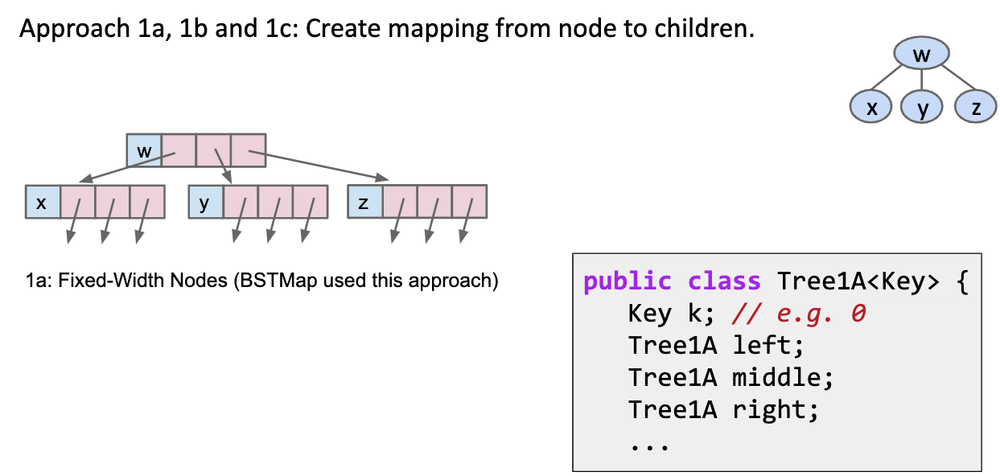
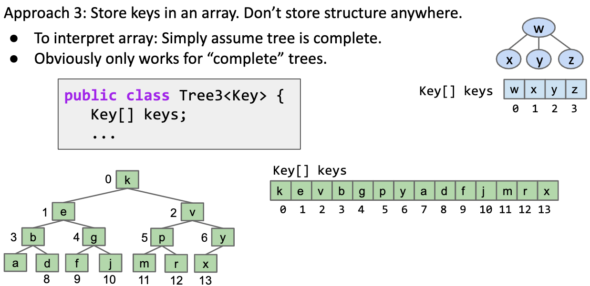
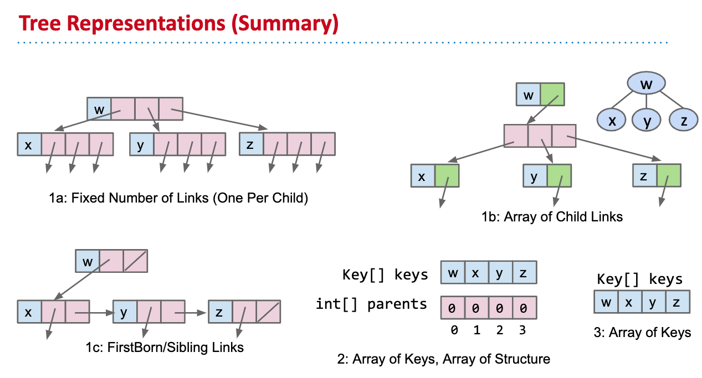

# Tree Representations

## How do we Represent a Tree in Java ?

### Approach 1a



### Approach 1b


### Approach 1c


### Approach 1


### Approach 2


### Approach 3



We don't need a parents array, since it is complete tree, we can always find a node's parent.

## Deep dive into Approach 3

### How to find a node's parent


```java
public int parent(int k) {
    return (k-1)/2;
}
```

Small note: in java

```java
9/2 = 4
8/2 = 4
```

## Summary



