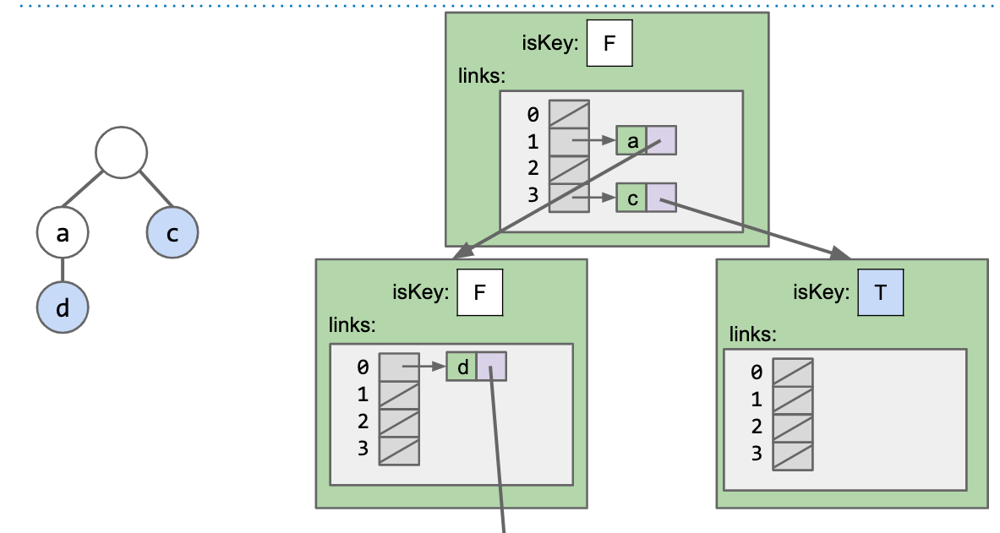
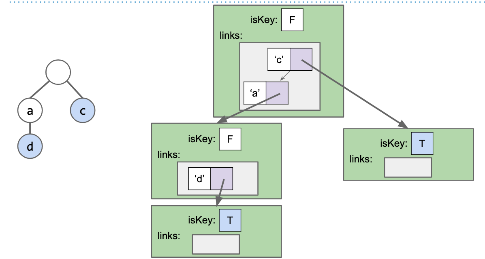

# Alternate Children Track.

The DataIndexedCharMap next, tracks children, but at every node, it wastes a lot of memory, a lot of empty links.

Fundamental problem: our indexed array are sparse.

---

How about a HashTable Trie?

---

How about a BST Trie?

---

Performance:

+ DataIndexedCharMap: 128 links pernode, Theta(1)
+ BST: C links per node, where c is the number of children, O(logR), R is the size your alphabet.
+ HashTable: C links per node. O(R), R is the szie of alphabet.
+ Note: Cost per link is higher in BST and HashTable

---

Where Trie is really good at?

is [Special String Operations]