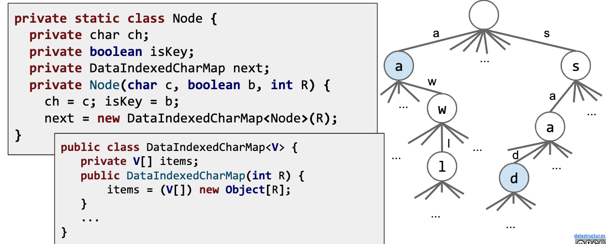
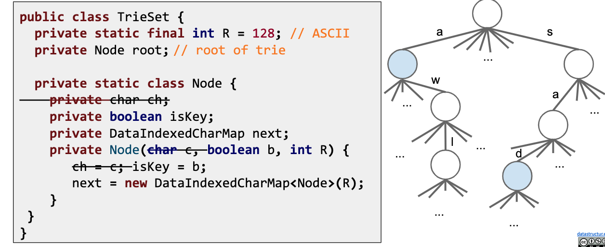

# Trie Implementation and Performance

The first approach might look something like the code below.

+ Each node stores a letter, a map from c to al child nodes, and a color to indicate its the end of a word or not.

```java
public class TrieSet {
    private static final int R = 128;   // ASCII
    private Node root;  // root of trie

    private static class Node {
        private char ch;    // the value stores 'a', 'b'
        // The color to indicate its a key
        private boolean isKey;
        // since we know our keys are characters, we can use a DataIndexedCharMap
        private DataIndexedCharMap next;
        private Node(char c, boolean b, int R)  {
            ch = c;
            isKey = b;
            next = new DataIndexedCharMap<Node>(R);
        }  
    }
}
```

---

Let's zoom in on a node


---

If we use a DataIndexedCharMap to track children, every node has R links.



---

Observation: The letter stored inside each node is actually redundant.

We can remove from the representation.



---

Trie Performance in terms of N.

Given a Trie with N keys. What is:

+ Add runtime? Theta(1)
+ Contains runtime? Theta(1)

Let's look for "potato", go from the root-"p"-"0"-...

it doesn't matter how many items (keys) we have in the trie. it will always be constant time.

Runtime is independent of number of keys!

---

Summary:

