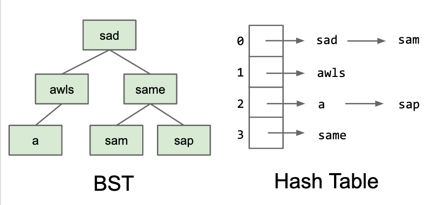

# Tries

```
Runtime:   contains(x)              add(x)
BST         Theta(logN)             Theta(logN)

HashTable Theta(1) on average       Theta(1) on average if evenly spreaded
```

---

But if we know some additional information about our keys, we can sometimes get even better result.

Example:

Suppose we know our keys are always single ASCII.

+ e.g. 'a', 'g', '!'

---

Special Case 1: Character Keyed Map.

```java
public class DataIndexedCharMap<V> {
    private V[] items;
    public DataIndexedChapMap(int R) {
        items = (V[]) new Object[R];
    }
    /* R is the number of possible characters, 128 for ASCII. */
    public void put(char c, V val) {
        // character c serves as the index.
        items[c] = val;
    }
    public V get(char c) {
        return items[c];
    }
}
```

---

Special Case 2: String keyed Map

Suppose we know that our keys are always strings

+ Can use a special data structure known as `Trie`.
+ Basic idea: Store each letter of the string as a node in a tree.

---

Set of Strings



---

Tries: Each Node Stores One Character

For String keys, we can use a Trie. Key ideas:

+ Every node stores only one letter.
+ Nodes can be shared by multiple keys.


To make clear our Trie contains "sam", "sad", "same", "a", "awls", but not "aw", "awl", "sa"

We color the leafs.

---

Search Hits and Misses


--- 

Trie can be map too.


---

Trie:

+ Short for Re`trie`val Tree.
  
---

Implementation:

[Basic implementation](Trie&#32;Basic&#32;Implementation.md)


[Alternate Children track strategy](Alternate&#32;Children&#32;Track.md)


[Special String Operations](Special&#32;String&#32;Operations.md)