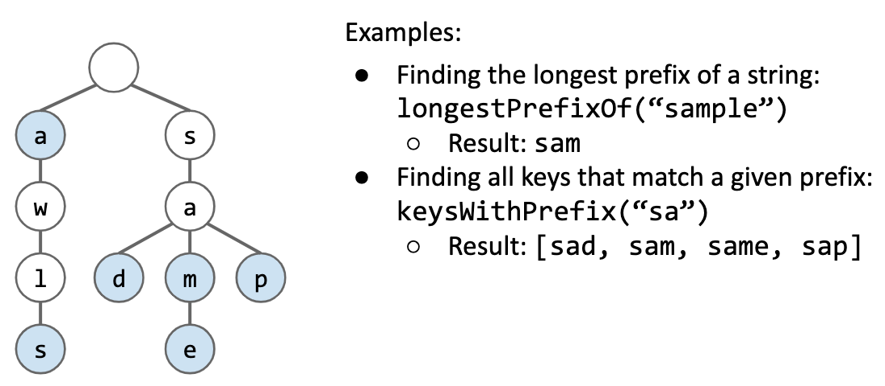

# Special String Operations with Trie

The main appeal of tries is their ability to efficiently support string specific operations like prefix matching.

---

## Prefix Matching

---

## Implementation

---

### Warm up: Collecting Trie Keys

Give an algorithm for collecting all the keys in a trie.

collect() returns ["a","awls", "sad","sam","same","sap"]

Algorithm:

collect():

+ Create empty list of results x.
+ For character c in root.next.keys():

    + call colHelp("c", x, root.next.get(c)).
+ return x.

colHelp(String s, List<String> x, Node n):

+ if n.isKey, then x.add(s).
+ For character c in n.next.keys():

    + call colHelp(s+c, x, n.next.get(c))

---

keysWithPrefix:

Example: keysWithPrefix("sa") is ["sad","sam","same","sap"]

Algorithm:

+ Find the node pink corresponding to the string.
+ Create an empty list x.
+ For character c in pink.next.keys():

    + call colHelp("sa" + c, x, pink.next.get(c))