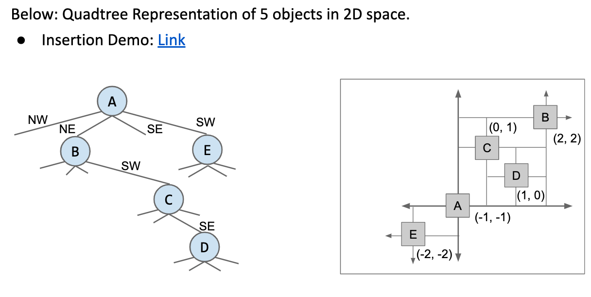
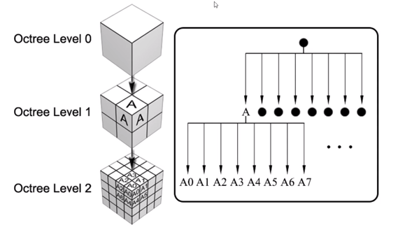
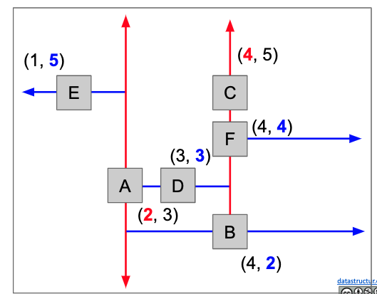
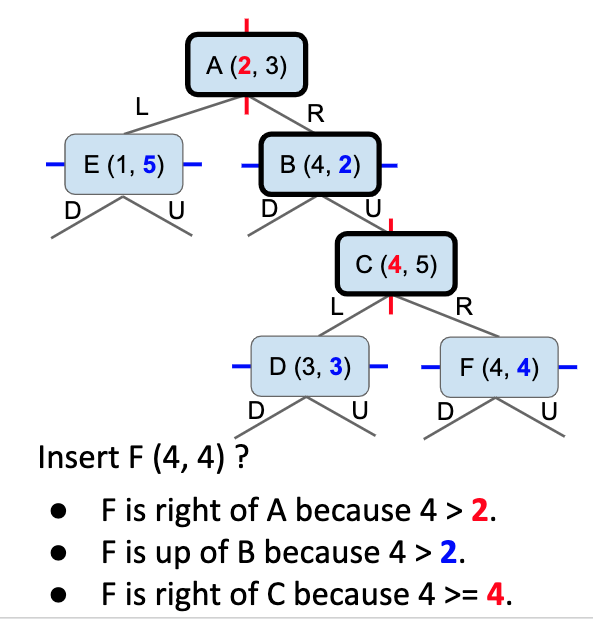
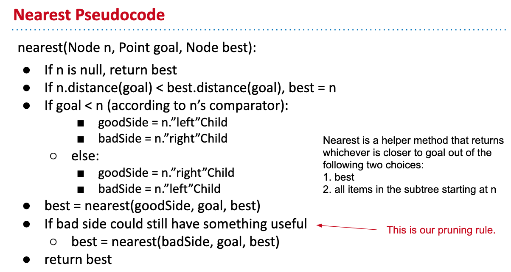

# Range Searching and Multi-Dimensional Data

[61b slides](https://docs.google.com/presentation/d/1lsbD88IP3XzrPkWMQ_SfueEgfiUbxdpo-90Xu_mih5U/edit)

----------------

## Trees vs Hash Tables

One key advantage of Search Trees over Hash Tables is that trees explicitly track the order of items.

Examples:

+ Find the minimum item in a BST is Theta(logN) time, but Theta(N) in a hash table.
+ Can relatively easy modify BSTs to support operations like rank(5)

We'll exploit similar properties to improve the runtime of spatial operations like nearest

---------

## Quadtrees

Quadtrees: Hierarchical partitional, Each node "owns" 4 subspaces.

+ space is more finly divied in regions where they are more points.
+ Results is better runtime in many circumstances.

---------

## Quadtree Demo

[Insertion demo](https://docs.google.com/presentation/d/1lsbD88IP3XzrPkWMQ_SfueEgfiUbxdpo-90Xu_mih5U/edit)

------
## Higher dimensional Data

3D data.

We can use Oct-tree. 8 regions.

------------

For even higher Dimensional Space, for example:

Want to find songs with the following features:

+ length between 3 minutes and 6 minutes
+ Between 1000 and 20,000 listens
+ Between 120 to 150 BPM.
+ Were recorded after 2004.

We can use K-D tree.

-----------

## K-D tree

for 2-d:

+ Basic idea, root node partitions entire space into left and right (by x)
+ All depth 1 nodes partition subspace into up and down (by y)
+ All depth 2 nodes partition subspace into left and right(by x)
+ if 3-d, we just partition space by x,y,z,x,y,z

[demo](https://docs.google.com/presentation/d/1WW56RnFa3g6UJEquuIBymMcu9k2nqLrOE1ZlnTYFebg/edit#slide=id.g54b6045b73_0_38)

Each point owns 2 subspaces

---------

## K-d tree nearest

[demo](https://docs.google.com/presentation/d/1DNunK22t-4OU_9c-OBgKkMAdly9aZQkWuv_tBkDg1G4/edit)

-----------

## Implementation

-----------

## Application

Multidimensional data has interesting operations

+ Range Finding: What are all the objects inside this subspace
+ Nearest: What is the closest object to a specific point?

The most common approacth is spatial partitioning:

+ Uniform Partitioning: Analogous to hashing
+ Quadtree: Generalized 2D BST 
+ K-d Tree: Generalized k-d BST : Dimension of ownership cycles with each level of depth in tree.