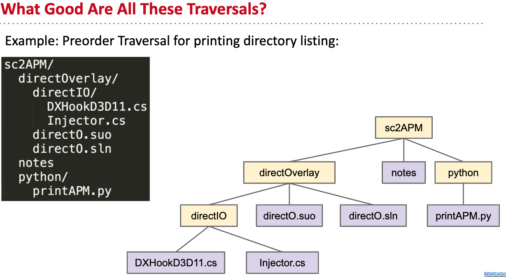
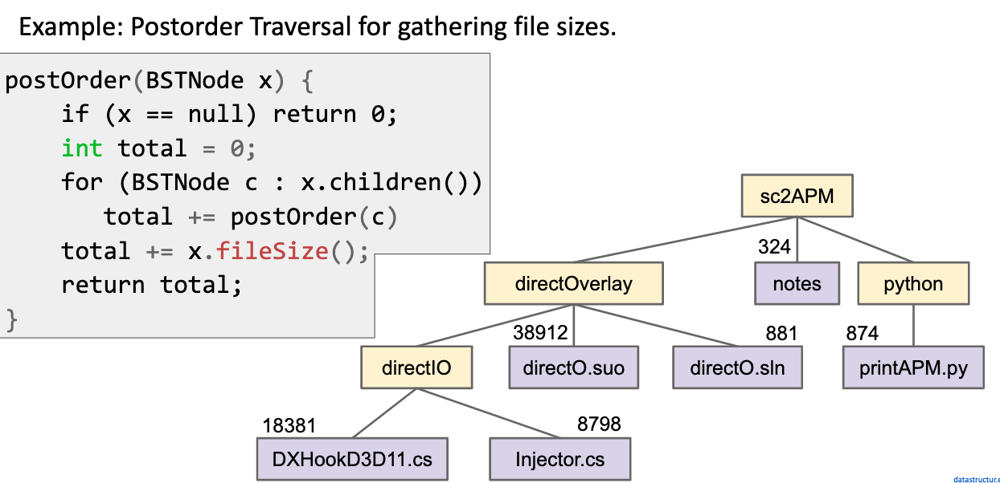

# Tree Traversal

## Tree Traversal Orderings

1. Breadth First Traversals
   
   Level Order : Visit top-to-bottom, left-to-right(like reading in English): D, B, F, A, C, E, G


2. Depth First Traversals

+ Preorder: "Visit" a node, then traverse its children:

    D B A C F E G

    ```java
    preOrder(BSTNode x) {
        if (x == null) return;
        print(x.key);   // Visit a node first
        // Then visit its children
        preOrder(x.left);
        preOrder(x.right);
    }
    ```

    Pre: "Visit" a node first.

+ Inorder: Traverse left child, visit the node, then traverse right child: 
   
   A B C D E F G

   ```java
   inOrder(BSTNode x) {
       if (x == null) return;
       inOrder(x.left); // Traverse left child
       print(x.key);    // Visit this node
       inOrder(x.right);// Traverise right child
   }
   ```

+ Postorder: Traverse left, Traverse right, then visit the node:

    A C B E G F D

    ```java
    postOrder(BSTNode x) {
        if (x == null) return;
        postOrder(x.left);
        postOrder(x.right);
        print(x.key);
    }
    ```

## Human tricks:


## What good are these Traversals?

1. Preorder for printing directory listing:



2. Postorder for gathering file sizes:



to be this


3. Inorder seems obvious, if it is a binary search tree, in-order would give you a increasing array(sorted).