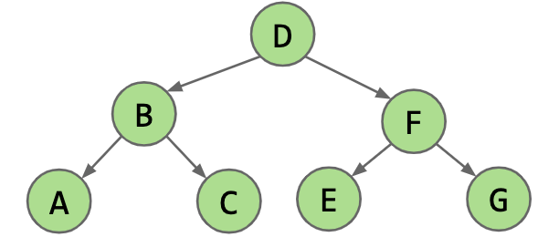

# In order Traversal

Example:



A B C D E F G

## Solution 1: Recursion (from definition)

This is obvious.

```java
public List<Integer> inorder(TreeNode root) {
    List<Integer> result = new ArrayList<>();
    return inorderHelper(root, result);
}

private List<Integer> inorder(TreeNode root, List<Integer> result) {
    if (root == null) return;
    inorder(root.left, result);
    result.add(root.val);
    inorder(root.right, result);
}
```

## Solution 2: Iteration use a stack

```java
public List<Integer> inorder(TreeNode root) {
    List<Integer> result = new ArrayList<>();
    Stack<TreeNode> stack = new Stack<>();
    TreeNode curr = root;

    while (curr != null || !stack.isEmpty()) {
        while (curr != null) {
            stack.push(curr);
            curr = curr.left;
        }
        curr = stack.pop();
        result.add(curr.val);
        curr = curr.right;
    }
    return result;
}
```